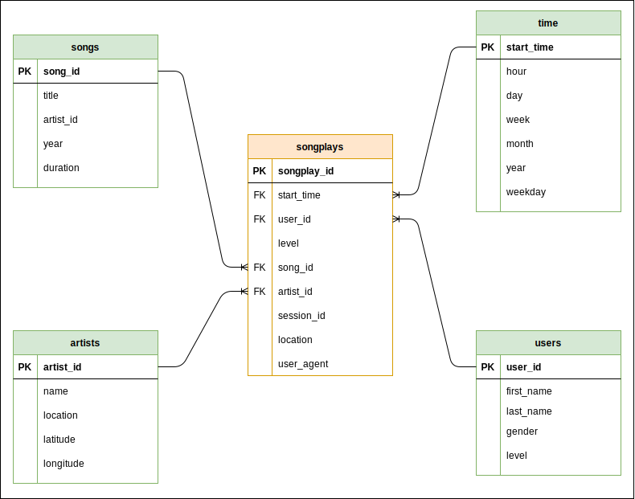

# Data Modeling with Postgres

First project for Udacity's Data Engineer Nano-Degree

## Situation

Sparkify, a music streaming company, has some local song records as well as some
history on user activity. The analytics team wants to understand what songs
people are listening to.

Since the song files and user data files currently live in json files on disk,
it is hard to generate this type of insights.

## Task

Our task is to design and implement a relational database for songs, artist,
users, times and songplays, facilitating the task of the analytics team and
ensuring that the data is accessible and understandable.

## Analysis

We've chosen to (closely) follow a star-schema for our database due to its
simplicity and popularity. The star schema, as its name suggests consists of a
fact table (in our case songplays), linked to multiple dimension tables (in our
case users, songs, artists, and time).

The reason our schema is not 'purely star' is because there is some redundancy
in the songs dimension table, related to the artists dimension table. In a
'pure' star schema dimension tables should not be related. An alternative to the
star schema is the snowflake schema which accommodates for exactly these
situations: a dimension table related to other 'secondary' dimension tables.
However since in our case we only have this one relation to take care of, we
still follow a star schema and ignore the relation between songs and artists.

Below is the ERD for the `sparkifydb` database

*The ERD for the sparkifydb database*

## Results

By creating the appropriate sql queries for database creation, destruction, and
inserting, along with an ETL pipeline that processes the json files and performs
the inserts we succesfully moved Sparkify's data from disjoint json files living
on disk to a relational model following a Start schema and that is ready for
analysis.

## Outputs and Contents

Below is a list of the most relevant files with instructions on how to execute
the python scripts.

**Note**: This project was developed using python 3.9.7. Some of the packages
may need to be downgraded if using a lower version but there shouldn't be any
breaking changes.

To run the scripts make sure you have all neccesary packages (as listed in
`requirements.txt`) installed. The easiest way is to create a virtual
environment with your tool of choice (`venv`, `conda`), activate it, and run
`pip install -r requirements.txt`. 

### Production

The two most important scripts in this repo are:

* `create_tables.py`: Connects to the database, and creates all tables, dropping
  pre-existing ones. This can be run with `python create_tables.py`.

* `etl.py`: The main ETL pipeline which processes the json files in the `data/`
  directory and inserts rows into the tables. Run it with `python etl.py`.

* `sql_queries.py`: Contains all SQL queries for table creation, inserts, and
  auxiliary queries. Should not be ran directly except when testing.

### Prototyping

The repo also contains two jupyter notebooks that can come in handy when
prototyping:

* `etl.ipynb`: Provides step by step guidance on implementing the different
  steps in the ETL script.

* `test.ipynb`: Can be used to quickly connect to the database and check table
  creation and record insertion.
